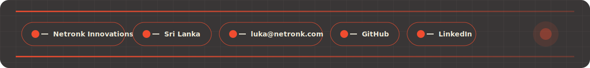
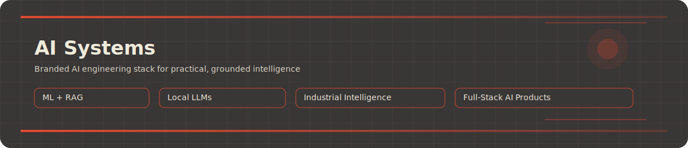

	

	

	<a href="https://netronk.com">Netronk Innovations</a> ·
	<a href="https://www.google.com/maps/place/Sri+Lanka">Sri Lanka</a> ·
	<a href="mailto:luka@netronk.com">luka@netronk.com</a> ·
	<a href="https://github.com/Luka-Ar">GitHub</a> ·
	<a href="https://linkedin.com/in/your-link">LinkedIn</a>

	

  

	

	

**Strategic Focus**

Gemma Fine-Tuning · RAG Architecture · Local LLM Systems · Industrial AI

 

**Engineering Intensity**

RAG Quality ████████░░ · Local LLM Ops ███████░░░ · ML Reliability ████████░░ · Product UX ███████░░░

 

**Industrial Intelligence Framework**

Signals → Models → Knowledge → Actions

	

	

### Predictive Maintenance Copilot
**Hybrid Industrial AI Decision Support System**

Repository: https://github.com/Luka-Ar/predictive-maintenance-copilot

Industrial AI platform that transforms sensor data into failure-risk predictions, condition alerts, knowledge-grounded explanations, and recommended actions.

 

**System Capability Matrix**

ML Engine: Python · Scikit-learn

API Core: FastAPI

Dashboard: Next.js

Local LLM: Gemma via Ollama

RAG Store: ChromaDB

Outputs: Alerts · Actions

 

**Architecture Flow**

Signals → ML Risk Scoring → RAG Grounding → Local LLM Reasoning → Actionable Maintenance

	

	

**AI / ML**

**Full-Stack Engineering**

	

	

	
	

	

	

	

Open to collaboration on AI products, applied ML systems, RAG tools, automation platforms, and full-stack AI software.

 

